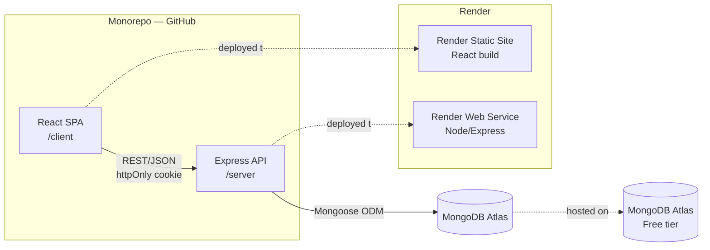

# SPEC.md — Learning Progress Tracker

## 1. Project Overview

A personal learning tracker web app for a single user to monitor progress across three platforms: Coursera, O'Reilly, and Frontend Masters. Tracks completion %, time spent, goals with deadlines, and key learnings per item. Built as a monorepo with a React SPA frontend and Node/Express REST API backend, deployed on Render with MongoDB Atlas.

---

## 2. Goals & Success Criteria

- User can register, log in, and have their data fully isolated behind JWT auth
- User can add, edit, and delete learning items across all three platforms
- Dashboard surfaces summary metrics (total items, avg completion, hours, done count)
- Goals panel shows up to 4 upcoming deadlines; notes feed shows 5 most recent notes
- Item list is filterable by platform
- App is responsive (mobile + desktop) and supports light/dark mode

---

## 3. Scope

### In Scope

- Email + password auth (register, login, logout, profile update, password change)
- Full CRUD for learning items
- Dashboard with summary metrics, goals panel, notes feed
- Item list with platform filter
- Inline add-item form; separate edit-item page
- Platform badge color-coding; status color-coding
- Responsive layout, light/dark mode
- Deployment on Render (frontend static site + backend web service) + MongoDB Atlas

### Out of Scope (v1)

- Auto-sync with Coursera / O'Reilly / Frontend Masters APIs
- OAuth / social login
- Email verification on registration
- Password reset via email
- Certificate uploads
- Notifications / reminders
- Charts / analytics graphs
- JSON data export

---

## 4. Architecture

### 4.1 Architecture Diagram



### 4.2 Component Descriptions

**React SPA (`/client`)**
- Responsibility: All UI rendering, client-side routing, form validation, state management
- Technology: React 18, TypeScript, Zod (form validation), Tailwind CSS, React Router v6
- Interfaces: Consumes REST API over HTTPS; reads/writes `httpOnly` JWT cookie via browser

**Express API (`/server`)**
- Responsibility: Auth, business logic, data access, request validation
- Technology: Node.js, Express, TypeScript, Zod (request validation), Mongoose
- Interfaces: Exposes REST endpoints under `/api/auth` and `/api/items`; connects to MongoDB Atlas

**MongoDB Atlas**
- Responsibility: Persistent storage for users and items
- Technology: MongoDB (free tier, 512 MB), Mongoose ODM
- Interfaces: Accessed exclusively by the Express server via `MONGODB_URI` env var

---

## 5. Data Model

### 5.1 Entities

#### User

| Field | Type | Required | Notes |
|---|---|---|---|
| `_id` | ObjectId | Yes | Auto-generated |
| `name` | string | Yes | Display name |
| `email` | string | Yes | Unique |
| `passwordHash` | string | Yes | bcrypt, 10 salt rounds |
| `createdAt` | datetime | Yes | Auto (Mongoose timestamps) |
| `updatedAt` | datetime | Yes | Auto (Mongoose timestamps) |

#### Item

| Field | Type | Required | Notes |
|---|---|---|---|
| `_id` | ObjectId | Yes | Auto-generated |
| `userId` | ObjectId | Yes | Ref → User._id |
| `name` | string | Yes | Title of course/book/video |
| `platform` | enum | Yes | `Coursera`, `O'Reilly`, `Frontend Masters` |
| `type` | enum | Yes | See platform types below |
| `progress` | integer 0–100 | Yes | Completion percentage |
| `hours` | float | No | Total hours logged |
| `deadline` | date | No | Target completion date |
| `status` | enum | Yes | `active`, `paused`, `done` |
| `tags` | string[] | No | e.g. `["React", "TypeScript"]` |
| `note` | string | No | Key learnings |
| `createdAt` | datetime | Yes | Auto |
| `updatedAt` | datetime | Yes | Auto |

#### Platform → Allowed Types

| Platform | Allowed types |
|---|---|
| Coursera | `Course` |
| O'Reilly | `Course`, `Book`, `Video` |
| Frontend Masters | `Course` |

### 5.2 Storage Strategy

- MongoDB Atlas free tier (512 MB) — sufficient for a single-user personal tracker
- Mongoose with `{ timestamps: true }` on both schemas
- No migrations needed for v1 (schema-flexible document store)
- Index: `items.userId` (for filtered queries per user); `users.email` (unique index)

---

## 6. API & Integration Contracts

### Auth Endpoints

#### `POST /api/auth/register`
- Auth: Public
- Request: `{ name: string, email: string, password: string }` (password min 8 chars)
- Response 201: `{ user: { _id, name, email } }`
- Errors: 400 validation error, 409 email already exists (return generic message — do not reveal existence)

#### `POST /api/auth/login`
- Auth: Public
- Request: `{ email: string, password: string }`
- Response 200: `{ user: { _id, name, email } }` + sets `httpOnly` JWT cookie (7d expiry)
- Errors: 401 generic "invalid credentials" (never reveal whether email exists)

#### `POST /api/auth/logout`
- Auth: User (JWT)
- Response 200: Clears JWT cookie

#### `GET /api/auth/me`
- Auth: User (JWT)
- Response 200: `{ user: { _id, name, email, createdAt } }`

#### `PUT /api/auth/me`
- Auth: User (JWT)
- Request: `{ name?: string, email?: string }`
- Response 200: `{ user: { _id, name, email } }`
- Errors: 409 if new email already taken

#### `PUT /api/auth/me/password`
- Auth: User (JWT)
- Request: `{ currentPassword: string, newPassword: string }` (newPassword min 8 chars)
- Response 200: `{ message: "Password updated" }`
- Errors: 401 if currentPassword incorrect

### Item Endpoints

All item endpoints require valid JWT. Server enforces `item.userId === req.user._id` — users can only access their own items.

#### `GET /api/items`
- Query params: none (platform filter done client-side)
- Response 200: `{ items: Item[] }` sorted by `updatedAt` desc

#### `POST /api/items`
- Request: `{ name, platform, type, progress, hours?, deadline?, status, tags?, note? }`
- Response 201: `{ item: Item }`
- Errors: 400 validation (name required, progress 0–100, type must be valid for platform)

#### `PUT /api/items/:id`
- Request: Partial item fields (same schema as POST)
- Response 200: `{ item: Item }`
- Errors: 404 not found, 403 not owner

#### `DELETE /api/items/:id`
- Response 200: `{ message: "Deleted" }`
- Errors: 404 not found, 403 not owner

### Zod Validation

Shared Zod schemas (mirrored in `/client` and `/server`) for:
- `registerSchema`, `loginSchema`
- `itemCreateSchema`, `itemUpdateSchema`

Platform/type cross-validation enforced in `itemCreateSchema` using `.refine()`.

---

## 7. Authentication & Authorisation

| Concern | Approach |
|---|---|
| Auth mechanism | JWT signed with `JWT_SECRET` env var, stored in `httpOnly` + `SameSite=Strict` cookie |
| Token expiry | 7 days |
| Token validation | `verifyToken` Express middleware on all `/api/items` and `/api/auth/me*` routes |
| Password storage | bcrypt hash, 10 salt rounds — never logged or returned in responses |
| Authorisation | Single role (authenticated user). Items are scoped to `userId` — server rejects cross-user access with 403 |
| Logout | Clears cookie by setting `maxAge: 0` |

---

## 8. Non-Functional Requirements

| Concern | Requirement | Approach |
|---|---|---|
| Security | Passwords never stored/logged in plain text | bcrypt only; Zod strips unknown fields |
| Security | JWT secret not hardcoded | Loaded from `JWT_SECRET` env var |
| Security | CORS restricted | `CLIENT_URL` env var used as Express CORS allow-list |
| Secrets | No credentials in source | All secrets via env vars; `.env` in `.gitignore` |
| Responsiveness | Mobile-first layout | Tailwind responsive prefixes (`sm:`, `md:`) |
| Accessibility | Dark mode | Tailwind `class` dark mode strategy; toggled via user preference |
| Availability | Best-effort (personal tool) | Render free tier; no SLA required |
| Data volume | Single user, small dataset | MongoDB Atlas free tier (512 MB) is sufficient |

---

## 9. Infrastructure & Deployment

### Environments

| Environment | Frontend | Backend | Database |
|---|---|---|---|
| Development | `localhost:5173` (Vite) | `localhost:3001` | Local MongoDB or Atlas dev cluster |
| Production | Render Static Site | Render Web Service | MongoDB Atlas free tier |

### Monorepo Structure

```
/
├── client/          # React + Vite + TypeScript
│   ├── src/
│   │   ├── pages/       # Dashboard, EditItem, Login, Register, Profile
│   │   ├── components/  # ItemCard, AddItemForm, GoalsPanel, NotesFeed, etc.
│   │   ├── api/         # Fetch wrappers for all endpoints
│   │   └── schemas/     # Shared Zod schemas (client copy)
│   └── vite.config.ts
├── server/          # Express + TypeScript
│   ├── src/
│   │   ├── routes/      # auth.ts, items.ts
│   │   ├── models/      # User.ts, Item.ts (Mongoose)
│   │   ├── middleware/  # verifyToken.ts
│   │   └── schemas/     # Shared Zod schemas (server copy)
│   └── tsconfig.json
└── README.md
```

### Environment Variables (backend)

| Variable | Description |
|---|---|
| `MONGODB_URI` | MongoDB Atlas connection string |
| `JWT_SECRET` | Secret key for signing JWTs |
| `CLIENT_URL` | Frontend URL for CORS allow-list |
| `NODE_ENV` | `production` or `development` |

### Deploy Steps

1. Push monorepo to GitHub
2. Create free MongoDB Atlas cluster; copy connection string
3. Create Render Web Service → point to `/server`; set all env vars
4. Create Render Static Site → point to `/client`; build command `npm run build`; publish dir `dist`
5. Set `CLIENT_URL` on backend to the Render frontend URL

### CI/CD

No automated pipeline required for v1. Manual deploy on push via Render's GitHub integration (auto-deploy on push to `main`).

---

## 10. Implementation Plan

### Phase 1 — Foundation (2–3 days)
- [ ] Scaffold monorepo: `/client` (Vite + React + TS + Tailwind) and `/server` (Express + TS)
- [ ] Configure ESLint, Prettier, TypeScript in both packages
- [ ] Mongoose models: `User`, `Item` with indexes
- [ ] Auth routes: register, login, logout, me (GET/PUT), password change
- [ ] `verifyToken` middleware
- [ ] `.env` setup and CORS configuration

### Phase 2 — Item CRUD API (1–2 days)
- [ ] Zod schemas: `itemCreateSchema`, `itemUpdateSchema` (with platform/type cross-validation)
- [ ] `GET /api/items`, `POST /api/items`, `PUT /api/items/:id`, `DELETE /api/items/:id`
- [ ] Ownership guard (403 on cross-user access)

### Phase 3 — Frontend Core (3–4 days)
- [ ] React Router setup: `/`, `/login`, `/register`, `/profile`, `/items/:id/edit`
- [ ] Auth pages: Login, Register
- [ ] Auth context / hook for current user state
- [ ] Dashboard layout: summary metrics, item list, goals panel, notes feed
- [ ] `ItemCard` component (badge, progress bar, status indicator, tags, delete)
- [ ] Inline `AddItemForm` (toggle open/closed, dynamic type dropdown)

### Phase 4 — Edit Page + Filtering (1–2 days)
- [ ] `/items/:id/edit` page with pre-populated form
- [ ] Platform filter (client-side, no API change needed)
- [ ] Goals panel: filter items where `status !== 'done'` and `deadline` set, show top 4 by deadline
- [ ] Notes feed: sort items by `updatedAt`, show top 5 with non-empty `note`

### Phase 5 — Polish (1–2 days)
- [ ] Dark mode toggle (Tailwind `class` strategy)
- [ ] Platform badge colors (Coursera: blue, O'Reilly Book: amber-dark, O'Reilly Course/Video: amber-light, Frontend Masters: purple)
- [ ] Status colors (active: green, paused: amber, done: blue)
- [ ] Progress bar color matches status
- [ ] Empty states for item list, goals panel, notes feed
- [ ] Profile page (view/edit name+email, change password)
- [ ] Mobile responsive pass

---

## 11. Open Questions & Risks

| # | Question / Risk | Owner | Status |
|---|---|---|---|
| 1 | Render free tier spins down after inactivity — first request after idle can take 30s. Acceptable for a personal tool, but worth noting. | Dev | Accepted |
| 2 | Zod schemas are duplicated in `/client` and `/server`. If they diverge, validation inconsistencies appear. Consider a shared `/packages/schemas` package if this becomes a pain point. | Dev | Open |
| 3 | No email verification means anyone can register with any email. Acceptable for v1 (single-user intent). | — | Accepted |

---

## 12. Assumptions

- The app is used by a single person; there is no admin role, team features, or multi-tenancy beyond basic user isolation
- The free Render + Atlas tier is acceptable for v1 performance and availability
- Platform filter is sufficient for v1; additional filters (status, tags) are deferred
- Client-side platform filtering is acceptable given small single-user data volumes
- O'Reilly allowed types are `Course`, `Book`, `Video` (requirements.md had a typo listing only `Book, Video`)
- Dark mode toggle is user-controlled (not automatic OS-preference detection), implemented via Tailwind `class` strategy

---

## 13. Glossary

| Term | Definition |
|---|---|
| Item | A single learning resource (course, book, or video) being tracked |
| Platform | One of: Coursera, O'Reilly, Frontend Masters |
| Status | Lifecycle state of an item: `active`, `paused`, `done` |
| Progress | Integer 0–100 representing % completion of an item |
| Goals panel | Dashboard widget showing up to 4 non-done items with deadlines, sorted by soonest deadline |
| Notes feed | Dashboard widget showing the 5 most recently updated items that have a non-empty note |
| JWT | JSON Web Token — used for stateless authentication, stored in an httpOnly cookie |
| httpOnly cookie | Browser cookie inaccessible to JavaScript — used to store JWT securely |
| Monorepo | A single Git repository containing both `/client` and `/server` packages |
